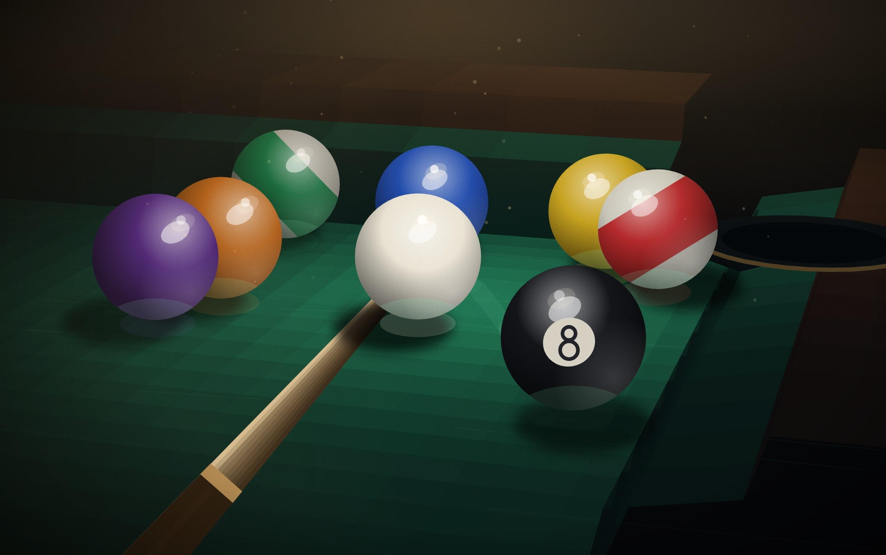
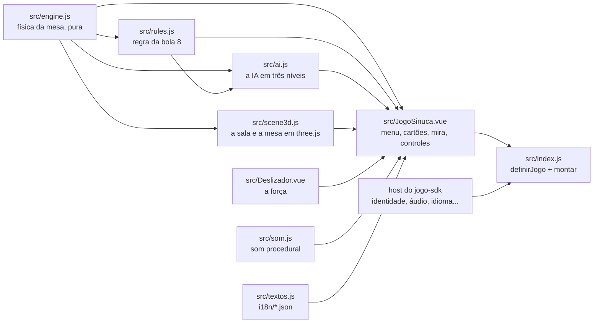

# Sinuca

A Sinuca do [RoqueOS](https://roqueos.com.br): bola 8 em 3D, numa mesa de bar, com física de
verdade. Jogue contra a IA em três níveis ou com alguém no mesmo aparelho. Jogue em
[roqueos.com.br/jogar/sinuca](https://roqueos.com.br/jogar/sinuca).

_English below._

## Por que existe

Até 25/09/2026 este jogo morava dentro do repositório do RoqueOS e importava as stores do
sistema direto. Agora ele é um repo próprio na organização
[roqueos-games](https://github.com/roqueos-games), aberto, e fala com o RoqueOS só pelo
[`jogo-sdk`](https://github.com/roqueos-games/jogo-sdk). O mesmo código roda no RoqueOS,
sozinho no seu navegador (`yarn dev`) e no teste.

## Como se joga

| Ação                | Como                                                                   |
| ------------------- | ---------------------------------------------------------------------- |
| mirar               | arraste na mesa para o lado: a mira gira em volta da branca            |
| força               | o deslizador **Força** (com foco, as setas, PageUp/PageDown, Home/End) |
| efeito              | o botão da bola branca abre o seletor; arraste o ponto na bola         |
| tacar               | o botão **Tacar**                                                      |
| bola na mão (falta) | toque e arraste na mesa para posicionar a branca, e solte              |
| voltar ao menu      | o **×** no cartão de cima                                              |

A regra é a bola 8 de bar, casual e honesta: a mesa fica aberta depois da saída, e a primeira
bola encaçapada de forma legal define quem fica com as lisas (1 a 7) e quem fica com as
listradas (9 a 15). Branca na caçapa, tacada que não toca bola nenhuma ou primeira bola tocada
que não é sua é falta, e o outro joga com bola na mão. Quem encaçapa uma das suas continua. A 8
depois de limpar as suas ganha; antes da hora, ou junto com uma falta, perde. Na saída a 8 volta
para a mesa.

## Arquitetura

- `src/engine.js` é a física, sem Vue e sem DOM: mesa de 2,24 m, bolas de 57,15 mm, atrito de
  deslize e de rolagem, tabela, efeito e caçapas, num passo fixo de 1/480 s. A mesma tacada dá
  sempre o mesmo resultado, e é isso que o teste e a IA usam.
- `src/rules.js` julga a tacada que parou: falta, de quem é a vez, grupos, fim de partida.
- `src/ai.js` escolhe a tacada da IA simulando as candidatas no próprio motor; o nível decide
  quantas candidatas ela testa e quanto a mira e a força dela erram.
- `src/scene3d.js` desenha a sala (mesa, luzes, bar) com [three.js](https://threejs.org), tudo
  procedural, sem modelo nem textura baixada. No perfil leve nasce sem antialias, sem sombra,
  com material mais simples e pixel ratio menor. Se a GPU não cria o contexto, a cena vira uma
  API que não faz nada, e o jogo não quebra.
- `src/JogoSinuca.vue` é a tela: menu, escolha de nível, cartões dos jogadores, mira com a
  linha-guia, seletor de efeito, deslizador de força e o fim de partida. Tudo o que vem do
  sistema (nome do jogador, áudio, perfil de aparelho fraco, métrica, idioma) chega pelo `host`.
- `src/index.js` cria um app Vue próprio dentro do elemento que o host entrega e devolve
  `{ ativar, desmontar }`. Só a janela ativa anda a física; desmontar solta o laço, os
  ouvintes e os relógios, e descarta o renderer e o que a cena criou.
- `jogo.json` é o manifesto: nome e descrição nos dez idiomas, SEO, etiquetas, capa, ícone e
  tamanho de janela. O RoqueOS confere que ele bate com o catálogo.

A Sinuca não guarda nada: nem recorde, nem placar na conta (`recorde: null` no manifesto). O
`three` é `peerDependency`: o RoqueOS fornece o dele, e o jogo não traz outro. A versão exata em
`devDependencies` é a mesma que o RoqueOS instala, para o teste e o `yarn dev` verem o que o
jogador vê.

## Pré-requisitos

- Node 24 (o `.nvmrc` diz), ou 22 no mínimo.
- Yarn 1.22.

## Como rodar

1. `yarn install --ignore-scripts`
2. `yarn dev` e abra o endereço que o Vite mostrar: o jogo roda com o host de
   desenvolvimento do SDK.
3. `yarn verificar` antes de abrir PR: lint, formato, testes e o `jogo check`, o mesmo que o
   CI roda.

O teste roda no jsdom, que não tem WebGL: o `three` é trocado por um dublê
(`test/threeStub.js`). Verde no teste não diz nada sobre o desenho na GPU. Mudança no código
que toca a GPU (`src/scene3d.js`: renderer, materiais, luzes, sombras, pixel ratio, perfil
leve) precisa ser vista num iPhone de verdade antes de subir.

## Estrutura

| Caminho              | O que é                                                                     |
| -------------------- | --------------------------------------------------------------------------- |
| `src/`               | o jogo (física, regra, IA, cena 3D, tela, deslizador, som, textos, entrada) |
| `i18n/`              | um JSON por idioma, com as mesmas chaves nos dez                            |
| `public/`            | capa e ícone; a origem de cada arquivo está no [ASSETS.md](ASSETS.md)       |
| `test/`              | testes com o host falso do SDK e o dublê do three, sem nada do RoqueOS      |
| `dev/`, `index.html` | o jogo sozinho no navegador, para desenvolver                               |
| `jogo.json`          | o manifesto que o RoqueOS lê                                                |

## Onde ele se encaixa

O RoqueOS instala este repo por uma tag exata e monta o jogo pelo `mount` do SDK, na janela,
em `/jogar/sinuca` e no modo TV. Uma mudança aqui só chega ao RoqueOS quando uma tag nova é
pinada lá, depois de revisada. Os nomes de evento (`game_start`, `game_over`, com `mode` e,
contra a IA, `level`) não mudam: o histórico de uso depende deles. O gancho `window.__pool`,
que só existe em modo E2E, é o que o QA e a captura de capa do RoqueOS usam.

## Licença

MIT, no código e na arte própria. Veja [LICENSE](LICENSE) e [ASSETS.md](ASSETS.md).

---

## English

8-ball pool from [RoqueOS](https://roqueos.com.br): 3D, a bar table, real physics, against the
AI on three levels or with a friend on the same device. It talks to RoqueOS only through the
[`jogo-sdk`](https://github.com/roqueos-games/jogo-sdk), so the same code runs inside RoqueOS,
standalone in your browser and in tests.

- `yarn install --ignore-scripts`, then `yarn dev` to play it locally.
- `yarn verificar` runs lint, formatting, tests and `jogo check`, exactly like CI.
- Tests run in jsdom with a `three` stub; they say nothing about the GPU. Changes to
  `src/scene3d.js` need to be checked on a real iPhone.
- Code and comments are in Brazilian Portuguese; issues and pull requests in English are
  welcome.
- Event names (`game_start`, `game_over`) are stable on purpose: analytics history depends on
  them. The game stores nothing locally or in the player's account.

MIT licensed, code and original art.
